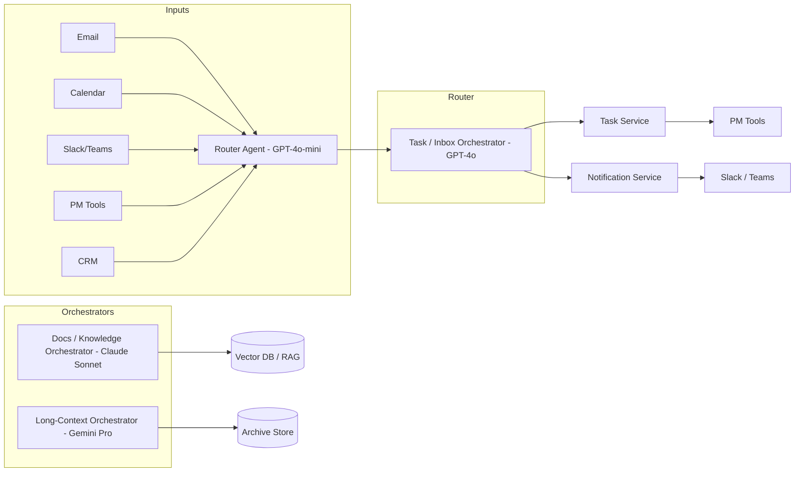

# LLM Choices for Chief‑of‑Staff (CoS) Agents – Deep Technical Guide (2026)

 It focuses on **which LLMs are best (free and paid)** for CoS‑style agents, **how startups vs big companies actually build them**, and **what features a strong CoS agent should support**.

---

## 1. Problem Framing

A Chief‑of‑Staff (CoS) agent is **not** just a chat bot. It is a **long‑running, multi‑tool orchestration system** that sits between humans and their work graph (email, calendar, docs, tasks, CRM) and continuously:

- Observes: reads events (emails, meetings, commits, tickets, docs).
- Understands: decides what matters, what is noise, what is risk.
- Acts: creates tasks, drafts communication, schedules, escalates.
- Reflects: learns preferences, improves prompts, updates state.

Choosing the LLM is therefore **an infrastructure decision**, not a UI decision. You care about:

- Reliability: determinism, low hallucination, consistent tool usage.
- Cost: you will call the model thousands of times/day in production.
- Context: ability to handle large workspaces (email threads, project history).
- Governance: data privacy, logging, rate‑limits, SLAs.

---

## 2. LLM Landscape for CoS Agents (2026)

### 2.1 Shortlist of Models You Actually Need to Care About

You *could* use dozens of models, but in practice most serious CoS builds in 2025–2026 standardize around a small core set:

- **OpenAI**
  - `gpt‑4o` – flagship, high‑reliability orchestrator.
  - `gpt‑4o‑mini` – cheap, small, good enough for 70–80% of background work.
- **Anthropic (Claude)**
  - `claude‑3.5‑sonnet` – strong reasoning + decomposition, good for documents/code.
  - `claude‑3.5‑haiku` – lighter, cheaper Claude family model.
- **Google (Gemini)**
  - `gemini‑1.5‑pro` – huge context windows, good for long documents & multimodal.
  - `gemini‑1.5‑flash` – fast, cheap, good for low‑stakes tasks.
- **Open‑source (self‑hosted or hosted by infra providers)**
  - `Llama‑3.1‑70B` (Meta) – strong general model, viable GPT‑4o‑mini alternative.
  - `Qwen‑2.5` / `Mixtral` variants – competitive mid‑tier models.

These are enough to design a **hybrid system** (premium + cheap + OSS backup) that can scale from side‑project to enterprise.

---

## 3. Model Comparison – Free vs Paid, By Use Case

### 3.1 Orchestration‑Focused Comparison Table

> Focus: using the model as the **agent brain** (tool‑calling, routing, reasoning), not as a pure writer.

| Rank | Model (2026) | Tier Type | Best Used For | Strengths | Weaknesses | Typical Pricing* |
|------|--------------|----------|---------------|-----------|-----------|------------------|
| 🥇 1 | **GPT‑4o** | Paid | Primary orchestrator for CoS agent | Best‑in‑class instruction following, robust tool calling, good reasoning, strong multilingual support | Expensive at scale, vendor lock‑in risk | ~5 USD / 1M input tokens, ~15 USD / 1M output tokens via API |
| 🥈 2 | **Claude 3.5 Sonnet** | Paid | Deep reasoning, document heavy workflows, complex decomposition | Excellent long‑context summarization, good code, human‑like writing style | Slightly less deterministic for strict tool schemas, can be over‑cautious | ~3 USD / 1M input, ~15 USD / 1M output (API) |
| 🥉 3 | **GPT‑4o‑mini** | Free+Paid | High‑volume low‑risk tasks, classification, simple transforms | 10–50× cheaper than GPT‑4o, good enough for routing, great for experimentation | Weaker reasoning, more small mistakes, still not fully “free” at API scale | ~0.15 USD / 1M input, ~0.60 USD / 1M output; free in ChatGPT UI |
| 4 | **Gemini 1.5 Pro** | Free+Paid | Very long context (large workspaces, wikis, email dumps) | 1–2M token context, good multimodal (images, some video), competitive price | Reliability, fact‑consistency and tool‑use less mature than GPT‑4o/Claude | ~1–2 USD / 1M input, ~5–8 USD / 1M output |
| 5 | **Claude 3.5 Haiku** | Free+Paid | Cheap Claude‑family workhorse | Cheap, decent reasoning, nice for text‑only pipelines | Lower quality vs Sonnet/GPT‑4o, not ideal as main brain | sub‑1 USD / 1M input, mid‑single digits output (varies) |
| 6 | **Llama‑3.1‑70B (self/hosted)** | Free (model) + infra cost | Privacy‑sensitive, on‑prem, cost‑controlled setups | No per‑token fees, full control, can be tuned, good for many business tasks | Needs infra + MLOps, still below GPT‑4o/Claude on hardest tasks | Infra: GPUs/TPUs or providers (Groq, Together, etc.) |

\* All prices approximate mid‑2026 public rates; always check the latest provider docs before committing.

---

### 3.2 Free‑Tier vs Paid‑Tier – Capability Table

> This table assumes **“typical” free consumer access** vs **entry‑level paid (20–30 USD/month seat)** and **API pay‑as‑you‑go**.

| Dimension | Free UI (ChatGPT / Claude / Gemini) | Paid Individual (ChatGPT Plus / Claude Pro / Gemini Advanced) | API (Pay‑as‑you‑go) | Enterprise (Copilot, Claude for Work, Azure OpenAI, etc.) |
|----------|--------------------------------------|---------------------------------------------------------------|---------------------|------------------------------------------------------------|
| Intended Use | Personal, exploration, prototyping | Power users, small teams | Apps, agents, automation | Org‑wide, regulated workloads |
| Model Access | Smaller variants, some access to flagship models with limits | Full access to flagship models (GPT‑4o, Claude Sonnet, Gemini Pro) | Any model exposed by provider | Same as API, often with added enterprise‑only SKUs |
| Rate Limits | Low daily message caps, throttling at peak | 3–5× more messages, priority routing | Hard RPM/TPM caps per key, but scalable | High caps, SLAs, support escalation |
| Context Window | 128K–200K typical | 128K–200K, some models higher | 128K–2M depending on endpoint | Same, plus version pinning and stability guarantees |
| File / Tools | Limited file size & count, experimental tools | Larger files, code tools, advanced browsing, workspaces | Full tool‑calling, function‑calling, streaming | Same plus private tools, enterprise connectors |
| Data Use | Usually opt‑out required to avoid training | Similar; Pro accounts often excluded from training by default (check docs) | No training on API data (major vendors) | Strongest guarantees, DPAs, compliance APIs |
| Governance | Per‑user controls only | Slightly better controls | API‑level control via code | SSO, RBAC, audit logs, policy engines |

**Practical takeaway:**

- For a **portfolio / side‑project CoS agent**, you can combine **free UI + minimal API usage**.
- For a **startup or internal tool**, treat **API + small paid seats** as the baseline.
- For **enterprise CoS**, you almost always go through **enterprise contracts** (Azure OpenAI, Claude for Work, Microsoft 365 Copilot, etc.).

---

## 4. Which Model to Use, When (Opinionated Recommendations)

### 4.1 For Your Use Case (Developer‑Led CoS Agent)

If you are building a CoS agent as a technical founder / engineer, a sensible **three‑tier model strategy** is:

1. **Primary brain (high‑stakes reasoning + tool calling)**  
   - Use **GPT‑4o** *or* **Claude 3.5 Sonnet**.  
   - Choose GPT‑4o when you care most about **strict instruction following and tool schemas**.  
   - Choose Claude Sonnet when you expect a lot of **document analysis + decomposition + writing**.

2. **Worker tier (cheap, high‑volume jobs)**  
   - Use **GPT‑4o‑mini** or **Claude Haiku** for: categorization, light summarization, email triage, simple routing.

3. **Heavy‑context / archival workflows**  
   - When you need to look at **entire Notion spaces / multi‑month email archives**, call **Gemini 1.5 Pro** or a long‑context open‑source model hosted on a provider.

### 4.2 If You Must Stay Free or Near‑Free

You can still get **serious CoS‑like behavior** without paying for high‑end seats:

- Use **ChatGPT free (GPT‑4o‑mini)** for:
  - Designing prompts.
  - Synthesizing logic for your orchestration.
  - Occasional manual runs of workflows.
- Use **Anthropic free UI (Claude Sonnet)** to debug prompts for document‑centric flows.
- Use **open‑source Llama‑3.1‑7B/70B via Ollama** for local experimentation and basic automation.

In production, however, **free tiers alone are not reliable** enough (rate limits, throttling, ToS). A CoS agent you want others to depend on should at least use **low‑cost API calls** on a cheap model (GPT‑4o‑mini or open‑source hosted on Groq/Together).

---

## 5. CoS Agent Feature Surface – What a Strong System Actually Does

A serious CoS agent is **feature‑rich but compositionally simple**. Nearly everything is built from the same primitives: read → understand → write → schedule → notify.

### 5.1 Core Feature Matrix

| Category | Concrete Features | LLM Requirements |
|----------|-------------------|------------------|
| Inbox Intelligence | Priority inbox, automatic tagging, action‑item extraction, sentiment/risk detection | Good classification + extraction, low hallucination, stable schemas |
| Task & Project Management | Auto‑create tasks from emails/meetings, due‑date inference, dependency detection, escalation rules | Date/time understanding, light planning, integration with PM APIs |
| Meeting Intelligence | Live or post‑hoc transcription, decision capture, owner assignment, follow‑up generation | Long‑context summarization, structured output (JSON), action extraction |
| Executive Briefings | Morning digests, weekly summaries, risk/OKR views, “what changed since yesterday?” | Multi‑source fusion (CRM + PM + email + calendar), narrative generation |
| Stakeholder Comms | Draft status emails, board updates, team announcements, customer updates | Audience‑aware writing style control, summarization, tone control |
| Knowledge & Search | “Ask your company” search over docs, past decisions, tickets | RAG stack + LLM that handles citations and retrieval instructions well |
| Strategy & Scenario Planning | What‑if analysis, impact estimation, trade‑off exploration | Higher‑end reasoning, ability to keep assumptions consistent across turns |

### 5.2 Example End‑to‑End Workflow (Executive Daily Brief)

1. **Ingest**  
   - Pull events from:
     - Gmail / Outlook (last 24h, important label).
     - Calendar (today + tomorrow).
     - PM tool (Jira/Linear/Notion tasks changed status).
     - CRM (deals moved stages, churn‑risk signals).

2. **Transform**  
   - Use a cheap worker model (`gpt‑4o‑mini` or `haiku`) to **normalize data** into a standard schema.

3. **Synthesize**  
   - Use **GPT‑4o or Claude Sonnet** with a prompt like:

   ```text
   System: You are an executive CoS agent. You receive normalized JSON events. 
   Produce a concise brief prioritized by urgency and impact.

   User: Here is the last 24h of events (JSON): ...
   ```

4. **Deliver**  
   - Post to Slack/Teams, email, and optionally write into a daily log in Notion.

---

## 6. How Startups vs Big Companies Build CoS Agents

### 6.1 Early‑Stage Startup Pattern (1–3 devs)

**Goal:** ship value in weeks, not quarters; tolerate some rough edges.

**Typical stack:**

- **Backend**: FastAPI / Node.js / Rails.
- **LLM orchestration**: Direct API calls or light frameworks (LangChain, LlamaIndex, Guidance).
- **Storage**: Postgres + Redis; Notion/Airtable for quick wins.
- **Integrations**: Zapier / Make.com / n8n for email, calendar, Slack, CRM.
- **LLMs**:
  - Primary: GPT‑4o or Claude Sonnet (few hundred calls/day).
  - Secondary: GPT‑4o‑mini / Haiku for cheap background tasks.

**Characteristics:**

- Minimal governance – API keys in env vars, basic logging.
- Prompt logic stored in repo (`prompts/` folder) and tuned in code.
- Often **single‑agent design** with a few “roles” embedded in prompts rather than a complex multi‑agent graph.

### 6.2 Growth‑Stage / SME Pattern

**Goal:** make CoS a **central internal tool** with 10–100 active users.

Differences vs tiny startup:

- Introduce **multi‑agent orchestration** (router agent + specialist agents for email, PM, CRM, docs).
- Add **feature flags, per‑user settings, and RBAC** (who can see what).
- Logging & monitoring: structured logs for each LLM call, latency SLOs, error handling.
- Mix of vendors:
  - e.g., GPT‑4o for orchestration, Gemini for long‑context doc analysis, OSS for offline batch jobs.

### 6.3 Enterprise Pattern (Large Co, Regulated)

**Goal:** integrate CoS into the **official work stack** with compliance.

Differences:

- LLMs accessed through **enterprise wrappers**:
  - Microsoft 365 Copilot (using GPT‑4‑class models under the hood).
  - Azure OpenAI (GPT‑4o behind corporate network).
  - Claude for Work / Enterprise (with DPAs, zero‑training guarantees).
- Identity & governance:
  - SSO (Azure AD, Okta), SCIM provisioning.
  - Central policy engines (what data can go where).
  - Audit logs for each LLM action.
- Architecture:
  - Often **event‑driven**, with Kafka / PubSub; CoS agent consumes events and writes actions.
  - Custom connectors to Jira, ServiceNow, Workday, Salesforce, etc.

**Feature differences vs startup CoS:**

- Scenario planning tied to CFO models, HR systems, formal OKR tools.
- Separation of **“personal” CoS (per‑exec)** vs **“organizational” CoS** (portfolio view).

---

## 7. Paid‑Tier Feature Breakdown – What You Actually Get

Below is a **conceptual** breakdown of what “paid” adds relative to free when you are building a CoS agent.

### 7.1 Capability Table – From Free Playground to Production System

| Layer | Free UI (Playground) | Paid Seats (Plus/Pro) | API (Pay‑as‑you‑go) | Enterprise (Org‑wide) |
|-------|----------------------|------------------------|---------------------|------------------------|
| Experiments | Manual prompt testing | Same but with higher limits and better models | Can script experiments, run batch prompts | Same as API, plus governance |
| Automation | Very limited (copy‑paste prompts) | Possible via browser automation, but hacky | **First serious automation tier**: cron jobs, webhooks, agents | Same, but with formal approvals and infra teams |
| Observability | None, just UI history | Same | Logs, metrics from your own app; token usage by endpoint | Central dashboards, SIEM export, alerts |
| Cost Control | None besides “stop using” | Same | Per‑key and per‑project budgets, spend alerts | Org‑level budget caps, procurement controls |
| SLAs | Best effort | Best effort | Basic SLAs from provider | Contractual SLAs, dedicated support |
| Licensing | Usually consumer terms | Still not full commercial in some cases | Stronger (no‑training, API‑specific Ts&Cs) | Full commercial + DPAs, compliance addenda |

**For a CoS agent that others rely on daily, you generally want**:

- Paid seats for **designers / PMs / engineers** to experiment with the UI.
- API usage for the **actual agent workflows**.
- Enterprise or at least business‑tier licensing once the tool becomes critical.

---

## 8. If Paid Is Not Available – Strong Alternatives

### 8.1 Open‑Source + Cheap Inference Providers

If you *cannot* or *do not want to* rely on premium paid proprietary models, an alternative stack is:

- **Model**: `Llama‑3.1‑70B` or latest high‑end open model.
- **Inference**:
  - Run locally on strong GPU (for personal use / small team).
  - Or use **Groq, Together, Anyscale, Fireworks, etc.** where per‑token cost is **way lower** than GPT‑4o.
- **Pattern**:
  - Use open‑source model for **80–90% of tasks**.
  - Optionally add a toggle to fall back to **proprietary GPT‑4o/Claude** when the user marks a workflow as “critical”.

**Pros:**

- No vendor lock‑in, more predictable long‑term cost.
- Can keep data on‑prem / VPC.

**Cons:**

- Require infra + MLOps.
- Still generally weaker at difficult reasoning vs GPT‑4o / Claude.

### 8.2 “Pre‑built” Enterprise CoS Platforms

If your goal is **business value** rather than building infra, consider:

- **WorkBoard AI Chief of Staff** – focused on OKRs and strategy execution.
- **Microsoft 365 Copilot / Copilot Agents** – deep Office/Teams integration.
- **Carly, Motion, various AI CoS startups** – ready‑made CoS experiences.

You can then build **thin custom layers** (Slack bots, web panels) on top rather than owning the full stack.

---

## 9. Example Architecture – Hybrid LLM CoS Agent



- Use cheap router model for classification and dispatch.  
- Use expensive orchestrators only when needed.  
- Keep tools (A1/A2, PMTools, SlackOut) as regular microservices, not inside the LLM.
---

## 10. GitHub Repositories & References

### 10.1 Open‑Source CoS‑Like Projects

> These are good to read for architecture, prompts, and integration patterns.

1. **Dex – Your AI Chief of Staff**  
   - Repo: `https://github.com/davekilleen/dex`  
   - Focus: personal operating system, extensible automation.  
   - Good for: seeing how a personal CoS‑style system is wired together.

2. **goagentflow/ai‑chief‑of‑staff**  
   - Repo: `https://github.com/goagentflow/ai-chief-of-staff` (via LinkedIn references).  
   - Focus: multi‑channel CoS using Claude and Microsoft 365.  
   - Good for: real‑world enterprise‑ish integrations.

3. **LangChain Templates – Agentic Patterns**  
   - Repo: `https://github.com/langchain-ai/langchain/tree/master/templates`  
   - Focus: multi‑agent orchestration, tools, memory.  
   - Good for: patterns for routing, tool‑calling and memory.

4. **LLM Agent Architecture Articles / Samples**  
   - IBM, Microsoft Copilot Studio, Anthropic agent architecture PDFs, etc.  
   - These typically give reference diagrams for enterprise agent systems.

---

### 10.2 Further Reading – LLMs & Agent Orchestration

- GPT vs Claude vs Gemini for agent tasks – Devansh (Medium, 2024).  
- Vendor docs on rate limits, pricing, and model capabilities for OpenAI, Anthropic, Google, and major inference providers.  
- Enterprise agent design docs from Microsoft Copilot Studio and Anthropic’s "Building Effective AI Agents" whitepaper.

---

## 11. Practical Starting Recipe (Opinionated)

For someone like you (developer, building a CoS agent as a serious project):

1. **Start with one premium + one cheap model**:
   - `gpt‑4o` for all orchestrator calls.
   - `gpt‑4o‑mini` for background workers.
2. **Design prompts + tools so that you can later swap in Claude / Gemini / OSS** without rewriting everything.
3. **Add telemetry early**: log every call (latency, tokens, failure modes).
4. **After you have product‑market fit**:
   - Introduce **Claude Sonnet** for document‑heavy flows.
   - Introduce **Gemini 1.5 Pro** only where the 1–2M context actually matters.
5. If cost becomes painful:
   - Move 60–80% of traffic to **OSS + cheap inference** while keeping critical paths on GPT‑4o/Claude.

This gives you a CoS agent that is:

- High enough quality to feel like a real executive assistant.
- Cheap enough to run as a startup.
- Flexible enough to evolve with the LLM ecosystem.

---

## Sources

- OpenAI model & pricing docs – GPT‑4o and GPT‑4o‑mini (2025–2026).
- Anthropic Claude 3.5 model + pricing docs, and third‑party benchmarks focusing on agent tasks.
- Google Gemini 1.5 Pro/Flash capability and pricing overviews.
- Public write‑ups comparing GPT‑4o, Claude, and Gemini for agent orchestration.  
- GitHub and Product Hunt listings for "AI Chief of Staff" tools and open‑source projects.
- Microsoft Copilot Studio and IBM documentation on agent architecture components.

---

## 12. Model Tiers for CoS Agents – Basic → Advanced (Free & Paid)

### 12.1 Free‑Tier Matrix – From Basic to Advanced CoS Automation

> Rough guidance only – exact limits change frequently; always verify in provider docs.

| Level | Provider & Model (UI) | Typical Use in CoS Agent | Key Limits (2026, approximate) | Why Choose It | When to Upgrade |
|-------|------------------------|---------------------------|-------------------------------|---------------|-----------------|
| Basic | **ChatGPT Free – GPT‑4o‑mini** | Design prompts, manual CoS workflows, light inbox triage | Daily message cap (roughly tens of messages/day), no SLA, no API; 128K context | Easiest place to experiment with logic and prompts before writing code | As soon as you need automation, webhooks, or consistent availability |
| Basic | **Claude Free – Sonnet 3.5** | Manual document summarization, meeting‑note drafting | Limited messages/day, throttling at peak, projects/memory features restricted | Excellent for long‑context docs and high‑quality writing | When you want persistent projects, higher limits, or API use |
| Basic | **Gemini Free (AI Studio – Flash models)** | Bulk summarization, quick experiments, multimodal tests | Free quota per day (hundreds–thousands of requests), UI‑only unless you switch to API | Very generous free tier, good for trying long‑context and multimodal flows | When you need stable API‑based automation and rate‑limit guarantees |
| Medium | **Ollama + Llama‑3.1‑8B/70B (local)** | On‑device experiments, privacy‑sensitive prototypes | Bound by your GPU/CPU; no vendor token limits; quality below GPT‑4o | Great for offline experiments and learning agent patterns | When you need higher reasoning quality or external integrations |
| Advanced (still “freeish”) | **Anthropic / OpenAI / Google API trial credits** | Run real CoS automation for a small team while spending only trial credits | Example: Anthropic ~5 USD credits; Google generous Gemini free API; OpenAI small trial credits | Lets you test real API‑driven CoS flows (cron jobs, webhooks) without initial spend | Once trial credits or free quota are exhausted and you need reliability |

**Key idea:** Free tiers are good for **thinking and prototyping**, not for running a CoS agent that other people depend on every day.

---

### 12.2 Paid‑Tier Matrix – Model‑by‑Model (USD, API Pricing)

> Numbers are based on public pricing aggregators and vendor docs as of early/mid‑2026. Always re‑check official pricing for production.

| Provider | Model (2026) | Context Window | Input / 1M tokens | Output / 1M tokens | CoS Role | Notes |
|----------|--------------|----------------|-------------------|-------------------|---------|-------|
| OpenAI | **GPT‑4o** | 128K | ~5.00 USD | ~15.00 USD | **Primary orchestrator (advanced)** | High reliability, best instruction following; ideal main brain for complex CoS workflows |
| OpenAI | **GPT‑4o‑mini** | 128K | **0.15 USD** | **0.60 USD** | **Worker model (basic → medium)** | Cheap, good for classification, routing, light summarization; perfect for background CoS jobs [web:67][web:70] |
| Anthropic | **Claude Sonnet 4.6 / 4.5 family** | 200K–1M | **3.00 USD** | **15.00 USD** | **Primary orchestrator / doc brain (advanced)** | Great for long documents, strategy memos, deep summaries; pairs well with GPT‑4o [web:68][web:71] |
| Anthropic | **Claude Haiku 4.5** | 200K | **0.80–1.00 USD** | **4.00–5.00 USD** | Worker model (basic → medium) | Fast, cheap, good for triage and preprocessing [web:68][web:71] |
| Google | **Gemini 2.5 Pro** | Up to 2M | **1.25–2.50 USD** | **10.00–15.00 USD** | Long‑context / archive brain (advanced) | Best suited when you truly need multi‑hundred‑page context [web:72][web:69] |
| Google | **Gemini 2.5 Flash** | 1M | **0.30 USD** | **2.50 USD** | Worker model (basic → medium) | Very cheap, good for summarization and low‑risk tasks [web:72][web:75] |
| OSS + infra | **Llama‑3.1‑70B** (example) | 128K–200K (provider‑dependent) | ~0.10–0.30 USD equivalent (provider‑dependent) | ~0.40–1.00 USD equivalent | Worker / backup brain (medium) | No per‑model licence fee; you pay only infra or provider cost; quality between mini models and top‑tier proprietary models [web:72] |

Why you do **not** see a separate “Claude 4.5 free model” in this table:

- Anthropic’s **free tier** currently exposes **Claude Sonnet‑class models** (e.g., 3.5 Sonnet) with UI‑level limits, not the latest 4.5/4.6 enterprise SKUs as a distinct product.
- For CoS automation, what matters is **API SKU + limits**, and those are branded as **Sonnet 4.x / Haiku 4.x / Opus 4.x** with the pricing above, not as “free 4.5”.[web:68][web:71][web:80]

---

### 12.3 Basic → Medium → Advanced – Recommended Model Choices

#### Basic CoS Agent (Solo Dev / Student / Early Prototype)

- **Goal:** Learn patterns, build a personal CoS for yourself.
- **Recommended stack:**
  - **Brain:** GPT‑4o‑mini (API) or Claude Haiku / Gemini Flash at low volume.
  - **UI support:** Use ChatGPT / Claude / Gemini free web UIs to iterate prompts.
  - **What it can handle:**
    - Triage your inbox.
    - Create to‑do list from emails and meetings.
    - Generate daily briefs for *you only*.
- **Why this tier:**
  - Very cheap, sometimes effectively free for light usage.
  - You learn orchestration without burning money.

#### Medium CoS Agent (Small Team / Startup Internal Tool)

- **Goal:** 5–50 people rely on the agent every day.
- **Recommended stack:**
  - **Primary brain:** GPT‑4o **or** Claude Sonnet 4.x.
  - **Worker tier:** GPT‑4o‑mini / Claude Haiku / Gemini Flash.
  - **Occasional long‑context:** Gemini Pro for huge docs when needed.
- **What it can handle:**
  - Multi‑user inbox intelligence (shared inboxes, ticket queues).
  - Meeting summaries pushed into Jira/Notion.
  - Weekly executive briefs aggregating multiple tools.
  - Basic scenario analysis (e.g., simple what‑ifs on pipeline numbers).
- **Why this tier:**
  - Balance between **quality** and **cost**.
  - Paid API gives stable rate‑limits and no surprise throttling.

#### Advanced CoS Agent (Product / Enterprise‑grade)

- **Goal:** CoS is a real product or a core internal platform.
- **Recommended stack:**
  - **Primary orchestrator(s):** GPT‑4o **and/or** Claude Sonnet 4.5/4.6.
  - **Specialist brains:**
    - Gemini 2.5 Pro for very long‑context reasoning.
    - OSS models (Llama‑3.1‑70B, etc.) for cost‑sensitive batch or on‑prem flows.
  - **Worker tier:** GPT‑4o‑mini, Haiku, Flash for classification, routing, extraction.
- **What it can handle:**
  - Department‑level or company‑level briefs and dashboards.
  - Strategy / OKR alignment checks.
  - Complex multi‑step automations across dozens of tools.
  - Strict audit, logging, and privacy rules.
- **Why this tier:**
  - You need **top‑tier reliability** and **support** (SLAs, DPAs, enterprise features).
  - Pricing is acceptable because CoS is business‑critical.

---

### 12.4 Example – Free‑Tier Style Spec (Analogy with Claude Limits)

Below is an **illustrative style** of how to think about limits (numbers are approximate and differ by vendor):

- **Model choice (basic free)**  
  - ChatGPT Free: GPT‑4o‑mini class.  
  - Claude Free: Claude Sonnet 3.5.  
  - Gemini Free: Flash family models.[web:71][web:72][web:74]

- **Message quota**  
  - Roughly **tens of messages per day** per vendor account, depending on load.  
  - Heavier usage triggers soft throttling (cool‑down windows).

- **Token consumption**  
  - Full conversation history counts until you clear/reset the chat.  
  - Long contexts (multi‑hundred‑page PDFs or huge email threads) burn through quotas quickly.

- **File uploads (UI)**  
  - Typical limits: **dozens of files per chat**, each on the order of **tens of MB** (20–30 MB) per file.  
  - API file upload limits are usually around **30–32 MB per request** for most vendors.[web:3][web:71]

- **Requests per minute (RPM)**  
  - Free tiers: often **single‑digit RPM** (1–5 RPM) in practice.  
  - Paid tiers: 10s to 1000s of RPM, depending on model and provider (e.g., Gemini Flash up to 2000 RPM on paid tier, Gemini Pro ~1000 RPM; Claude & OpenAI also scale by tier).[web:69][web:72]

- **Tokens per minute (TPM)**  
  - Vendors expose caps such as **hundreds of thousands of tokens per minute per API key**, increasing with paid tiers.  
  - For heavy CoS workloads, you typically need at least **hundreds of thousands of TPM** across orchestrator + worker models.

- **API credits / free trial**  
  - Anthropic: ~5 USD free credits for new accounts, plus student and startup programs with higher credit pools.[web:71]  
  - Google Gemini: generous free quotas on Flash/Flash‑Lite for experimentation.[web:72]  
  - OpenAI: small trial credits and occasionally promotions for new accounts.[web:76][web:79]

These constraints are why **serious CoS automation always ends up on paid/API tiers**, even if you start experimenting on free UIs.
